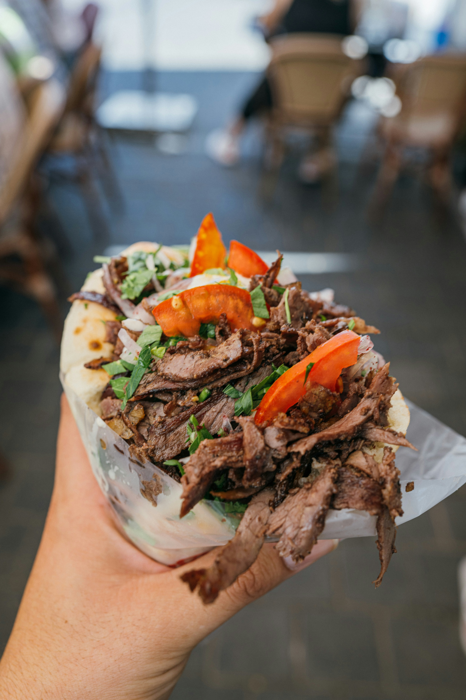
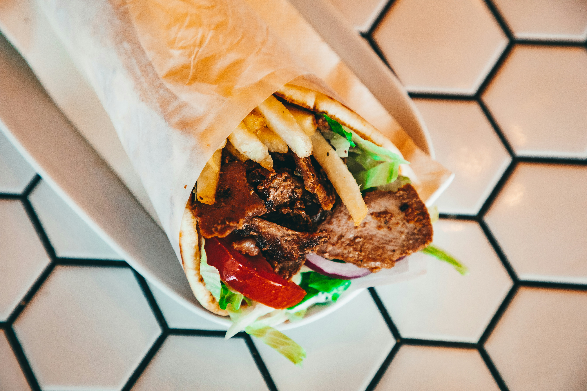
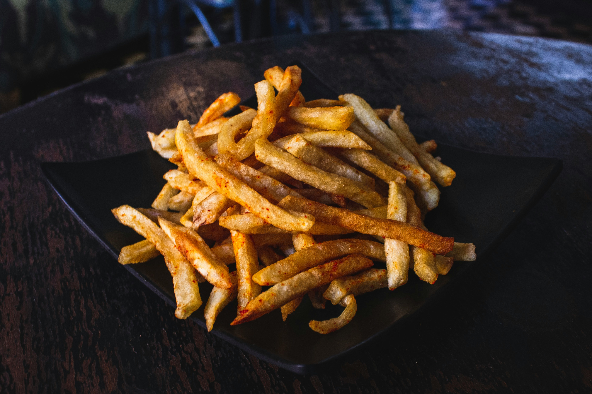

## 📸 Featured Creations from Berlin Bite Döner

Here you can explore the three authentic items we proudly serve at Berlin Bite.  
Each dish represents a piece of Berlin’s street-food culture — brought all the way to Vancouver.

---

## 🥙 Project 1: Classic Döner Kebab

Our signature Berlin-style Döner: freshly baked bread, shaved meat, crisp veggies, and homemade sauces.

**Image Preview:**  

---

## 🌯 Project 2: Döner Dürüm

A soft, grilled flatbread wrapped tightly around delicious fillings — perfect for on-the-go Döner lovers.

**Image Preview:**  

---

## 🍟 Project 3: Pommes Frites

Crispy, golden, perfectly salted fries — the essential side dish served “Berliner style.”

**Image Preview:**  

---
[← Back to Home](index.html)

